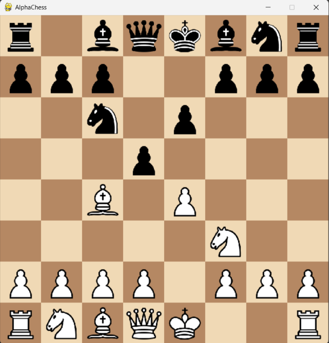

♟️ AlphaChess

«An AlphaZero-inspired Chess Engine powered by PyTorch, Monte Carlo Tree Search (MCTS), Stockfish Distillation, and Self-Play Reinforcement Learning.»

"Python" (https://img.shields.io/badge/Python-3.11-blue)
"PyTorch" (https://img.shields.io/badge/PyTorch-Deep%20Learning-red)
"Platform" (https://img.shields.io/badge/Platform-Windows%20%7C%20Linux-green)
"Status" (https://img.shields.io/badge/Status-Active-success)
"License" (https://img.shields.io/badge/License-MIT-yellow)

---

📖 Overview

AlphaChess is a deep learning chess engine inspired by Google's AlphaZero. It combines a deep residual neural network with Monte Carlo Tree Search (MCTS) to learn chess from historical games, Stockfish evaluations, and self-play reinforcement learning.

The project supports multiple training pipelines and provides both a graphical user interface and a terminal interface for playing against the AI.

---

✨ Features

- ♟️ AlphaZero-inspired architecture
- 🧠 Deep Residual Neural Network (AlphaChessNet)
- 🌳 Monte Carlo Tree Search (MCTS)
- 📚 Supervised Learning from Lichess PGN databases
- ⚙️ Stockfish Distillation Training
- 🔄 Self-Play Reinforcement Learning
- 🖥️ Interactive Pygame GUI
- 💻 Terminal Chess Interface
- 💾 Automatic checkpoint saving/loading
- ⚡ CPU & GPU support
- 📈 Resume training from saved checkpoints
- 🎯 4672-action policy output
- 📦 Modular project structure

---

🖼️ Screenshots

🎮 GUI

🏗️ Architecture

                Lichess PGN Database
                        │
                        ▼
            Supervised Learning
                        │
                        ▼
            AlphaChess Neural Network
                        │
                        ▼
             Stockfish Distillation
                        │
                        ▼
      Self-Play Reinforcement Learning
                        │
                        ▼
             Stronger Chess Engine
                        │
             ┌──────────┴──────────┐
             ▼                     ▼
        Pygame GUI          Terminal Play

---

📂 Project Structure

AlphaChess/
│
├── core/
│   ├── board_encoding.py
│   ├── config.py
│   ├── mcts.py
│   ├── model.py
│   ├── move_encoding.py
│   ├── pgn_dataset.py
│   ├── self_play.py
│   ├── stockfish_trainer.py
│   ├── trainer.py
│   └── utils.py
│
├── gui/
│   ├── chess_gui.py
│   └── pieces/
│
├── scripts/
│   ├── play_game.py
│   ├── train_supervised.py
│   ├── train_stockfish.py
│   └── train_selfplay.py
│
├── data/
├── saved_models/
├── logs/
├── stockfish/
├── requirements.txt
└── README.md

---

🚀 Installation

Clone the repository:

git clone https://github.com/bharath24-cloud/AlphaChess.git

cd AlphaChess

Create a virtual environment:

python -m venv venv

Activate the environment:

Windows

venv\Scripts\activate

Linux / macOS

source venv/bin/activate

Install dependencies:

pip install -r requirements.txt

---

🏋️ Training Pipeline

1️⃣ Supervised Learning

Train AlphaChess using Lichess PGN databases.

python scripts/train_supervised.py

---

2️⃣ Stockfish Distillation

Improve the network using Stockfish evaluations.

python scripts/train_stockfish.py

---

3️⃣ Self-Play Reinforcement Learning

Allow AlphaChess to improve through self-play using MCTS.

python scripts/train_selfplay.py

---

🎮 Play Against AlphaChess

Graphical Interface

python gui/chess_gui.py

Terminal Interface

python scripts/play_game.py

---

🧠 Neural Network

- 19-channel board representation
- Deep Residual Network
- Dual-head architecture
- Policy Head (4672 actions)
- Value Head
- Monte Carlo Tree Search (MCTS)
- PUCT Selection Algorithm

---

⚙️ Tech Stack

- Python
- PyTorch
- python-chess
- NumPy
- Pygame
- Stockfish
- Monte Carlo Tree Search (MCTS)
- Lichess Database

---

📈 Future Roadmap

- Opening Book
- Endgame Tablebases
- Stronger Neural Network
- Distributed Self-Play
- Multi-GPU Training
- Web Interface
- Lichess Integration
- Chess.com Integration
- ONNX Export
- TensorRT Inference
- Mobile Version

---

🤝 Contributing

Contributions are welcome!

1. Fork the repository
2. Create a feature branch
3. Commit your changes
4. Push your branch
5. Open a Pull Request

---

📄 License

This project is licensed under the MIT License.

---

⭐ Support

If you like this project, consider giving it a ⭐ on GitHub.

It helps others discover AlphaChess and motivates future development.
